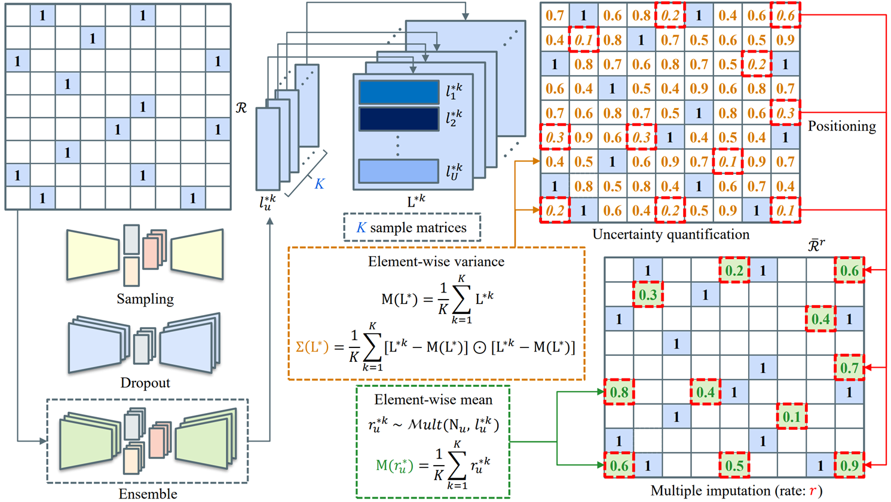

# An Uncertainty-Aware Imputation Framework for Alleviating the Sparsity Problem in Collaborative Filtering (CIKM 2022)

> This repository accompanies the paper **"An Uncertainty-Aware Imputation Framework for Alleviating the Sparsity Problem in Collaborative Filtering"** by Sunghyun Hwang and Dongkyu Chae, in **ACM International Conference on Information and Knowledge Management 2022 (a.k.a. CIKM 2022)**.  

  

> The code is released exclusively for review purposes with the following terms: PROPRIETARY AND CONFIDENTIAL. UNAUTHORIZED USE, COPYING, OR DISTRIBUTION OF THE CODE, VIA ANY MEDIUM, IS STRICTLY PROHIBITED. BY ACCESSING THE CODE, THE REVIEWERS AGREE TO DELETE THEM FROM ALL MEDIA AFTER THE REVIEW PERIOD IS OVER.

> We provide code for **UA-MI/base model**, **UA-MI/sampling**, **UA-MI/dropout**, and **UA- MI/ensemble** explanations and evaluate them. The code is set up for **Amazon-Book**, **CiteULike-a**, **Epinions**, and **MovieLens-20M** datasets, but can easily generalize to other recommendation datasets. First, the recommendation datasets described above can be loaded through code ```load_data.py``` and base functions for performing UA-MI can be executed through ```ua_mi_base.py```. Then our three UA-MI frameworks can be executed through codes ```ua_mi_sam.py```, ```ua_mi_do.py```, and ```ua_mi_ens.py```, respectively. The code ```evaluation.py``` operates based on the ensemble-based method among the three methods.

> > * ```load_data.py``` - Load each recommendation dataset from the data file and preprocess for UA-MI
> > * ```ua_mi_base.py``` - Load functions for UA-MI
> > * ```ua_mi_sam.py``` - Perform sampling-based UA-MI
> > * ```ua_mi_do.py``` - Perform dropout-based UA-MI
> > * ```ua_mi_ens.py``` - Perform ensemble-based UA-MI
> > * ```evaluation.py``` - Evaluate UA-MI with re-trained model

> Tested environment: We ran all our experiments on a single machine equipped with an **i9 11900K Intel CPU, 128GB RAM, and NVIDIA GeForce RTX3090 GPU. Used Anaconda Python 3.9.6**.
